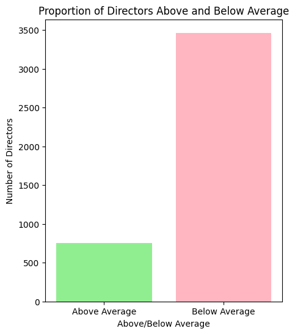
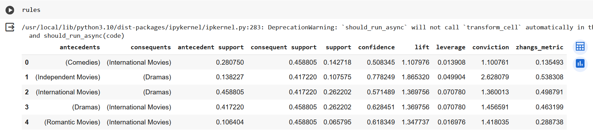
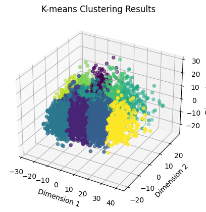
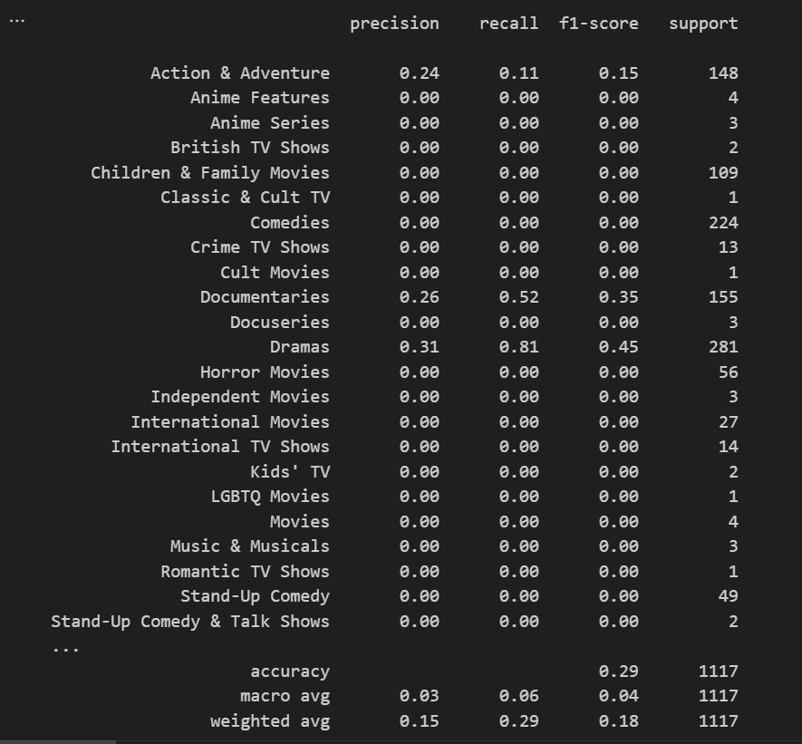

# Netflix Dataset Analysis and Classification
This project analyzes a dataset related to Netflix, one of the most popular media and video streaming platforms. The Netflix dataset contains information about over 8000 movies and TV shows, including details such as actors, directors, ratings, release years, genres and more.

## Overview
Our project is divided into three phases:

1. **Statistical Comparison of Directors:** In the first phase, the project conducts a statistical comparison between the number of films directed by each director and the average number of films by directors.

2. **Pattern Extraction between Directors, Cast, and Genre:** The second phase involves extracting patterns between directors, cast, and genre using the dataset.

3. **Classification of Genres:** In the third phase, the project classifies the dataset based on genres, and it includes the capability to predict the genre of a movie from the description of the test data.

## Usage
Simply run the code on Google Colab or Jupyter.

## Result
The precise and thorough results are present in the project file.

**phase 1 results:**

showing the proportion of directors that directed movies under the average amount and above average.

**phase 2 results:**

finding the pattern between director, cast and movie genre using support and confidence, and displaying the association rules.

**Clustering results:**

**phase 3 results:**

classification of series and movies based on genres.

## Contact
Created by [mahya.ehsanimehr@gmail.com](mailto:mahya.ehsanimehr@gmail.com) and [neg.jaafari@gmail.com](mailto: neg.jaafari@gmail.com)
